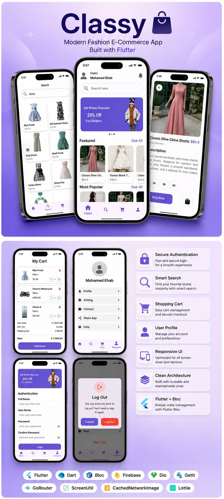

<div align="center">



# 🛍️ Classy

### Modern Fashion E-Commerce App built with Flutter

A beautiful, scalable and production-ready Flutter e-commerce application following **Clean Architecture**, **MVVM**, and **Bloc/Cubit** with a modern UI and seamless shopping experience.


</div>

---

# 📖 About

Classy is a modern fashion e-commerce mobile application developed using Flutter.

The application focuses on delivering a premium shopping experience through a clean interface, responsive layouts, reusable components, and scalable architecture.

It follows modern Flutter development best practices including:

- Clean Architecture
- MVVM Pattern
- Bloc/Cubit State Management
- Repository Pattern
- Dependency Injection
- Responsive UI
- Reusable Widgets

---

# ✨ Features

| Feature | Status |
|----------|:------:|
| Authentication | ✅ |
| Login & Register | ✅ |
| Home Screen | ✅ |
| Product Categories | ✅ |
| Featured Products | ✅ |
| Product Details | ✅ |
| Smart Search | ✅ |
| Shopping Cart | ✅ |
| User Profile | ✅ |
| Logout Confirmation | ✅ |
| Cached Images | ✅ |
| Pull To Refresh | ✅ |
| Loading States | ✅ |
| Error Handling | ✅ |
| Responsive UI | ✅ |

---

# 🏗 Architecture

```
                    Presentation Layer
                           │
                Bloc / Cubit (State Management)
                           │
                    Repository Layer
                           │
                     Data Source Layer
                           │
                  REST API / Local Storage
```

The project follows **Clean Architecture** to keep business logic independent from UI and data sources.

---

# 📂 Project Structure

```
lib
│
├── core
│   ├── constants
│   ├── networking
│   ├── routing
│   ├── services
│   ├── themes
│   ├── ui
│   ├── utils
│   └── widgets
│
├── feature
│   ├── auth
│   ├── home
│   ├── search
│   ├── cart
│   ├── profile
│   └── product_details
│
└── main.dart
```

---

# 🛠 Tech Stack

| Technology | Usage |
|------------|-------|
| Flutter | Cross Platform Development |
| Dart | Programming Language |
| Bloc / Cubit | State Management |
| Dio | Networking |
| GetIt | Dependency Injection |
| GoRouter | Navigation |
| SharedPreferences | Local Storage |
| CachedNetworkImage | Image Caching |
| Flutter ScreenUtil | Responsive Design |
| Lottie | Animations |

---

# 📦 Packages

- flutter_bloc
- dio
- get_it
- go_router
- cached_network_image
- flutter_screenutil
- lottie
- shared_preferences
- shimmer
- animated_snack_bar

---

# 🚀 Getting Started

Clone the repository

```bash
git clone https://github.com/yourusername/Classy.git
```

Go to the project

```bash
cd Classy
```

Install dependencies

```bash
flutter pub get
```

Run the application

```bash
flutter run
```

---

# 🎯 Future Improvements

- ❤️ Wishlist
- 💳 Payment Gateway
- ⭐ Product Reviews
- 🌙 Dark Mode
- 🌍 Localization

---

# 💙 Why Classy?

✔ Clean Architecture

✔ Modern UI

✔ Responsive Layout

✔ Reusable Components

✔ Scalable Project Structure

✔ Production Ready Code

✔ Easy to Maintain

---

# 👨‍💻 Author

### Mohamed Ehab

Flutter Developer

📧 bodaeheb10@gmail.com

💼 https://www.linkedin.com/in/mohamed-ehab74/

---

# ⭐ Support

If you like this project, don't forget to leave a ⭐ on the repository.

It motivates me to build more amazing Flutter projects ❤️
